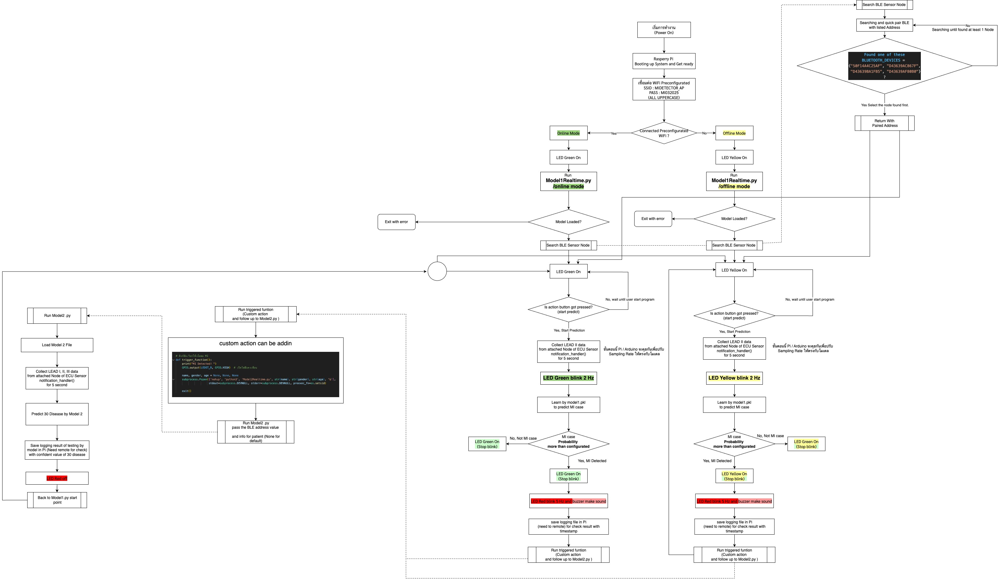

# ECG Pi iOS App

ECG Pi is a SwiftUI iOS application for viewing ECG monitoring results from a Raspberry Pi based ECG workflow. The app connects to Firebase, displays the latest device summary, stores guest profile information, shows historical ECG records, renders ECG waveforms, exports reports as PDF, and provides emergency/CPR guidance.

> This app is a student/research prototype and is not a certified medical device. ECG results shown in the app should not be used as a final diagnosis. Always consult qualified medical professionals for clinical decisions.

## Features

- Onboarding flow for ECG test preparation and electrode attachment guidance
- Guest registration and local session state with `UserDefaults`
- Device ID selection for Firestore-backed ECG devices
- Realtime latest result dashboard:
  - Heart rate
  - HRV
  - MI / abnormality detection flag
  - Last updated timestamp
- Firestore history list and detail screen
- ECG waveform rendering with SwiftUI `Canvas`
- PDF export/share for ECG result details
- Emergency page with CPR steps and AED location link
- Legal/privacy information sheet

## System Flow

The mobile app is part of a larger ECG pipeline where Raspberry Pi receives ECG sensor data, runs prediction logic, stores results, and exposes the latest summary/history through Firebase for the iOS app.



## Tech Stack

- SwiftUI
- Firebase iOS SDK `11.10.0`
- Firebase Core
- Firebase Auth
- Firebase Firestore
- Firebase Realtime Database
- PDFKit / UIKit PDF rendering
- Xcode project with Swift Package Manager

## Project Structure

```text
ECG_Pi/
├── ECG_Pi.xcodeproj
├── ECG_Pi/
│   ├── ECG_PiApp.swift
│   ├── SplashContainerView.swift
│   ├── IntroSliderView.swift
│   ├── LoginView.swift
│   ├── SignUpView.swift
│   ├── GuestRegistrationView.swift
│   ├── HomeView.swift
│   ├── HistoryListView.swift
│   ├── HistoryDetailView.swift
│   ├── SimpleECGGraphView.swift
│   ├── Assets.xcassets
│   └── GoogleService-Info.example.plist
├── ECG_PiTests/
├── ECG_PiUITests/
├── docs/
│   └── miflowchart.jpg
├── .gitignore
└── README.md
```

## Requirements

- macOS with Xcode 16 or newer
- iOS 18 SDK or compatible simulator/device target
- Firebase project with iOS app configured
- Internet connection for Firebase package resolution and Firestore access

## Firebase Setup

The real Firebase config file is intentionally ignored by Git:

```text
ECG_Pi/GoogleService-Info.plist
```

To run the app:

1. Create or open a Firebase project.
2. Add an iOS app using the same Bundle Identifier as the Xcode target.
3. Download `GoogleService-Info.plist`.
4. Place it at:

```text
ECG_Pi/GoogleService-Info.plist
```

5. Enable the Firebase services used by the app:
   - Firestore Database
   - Authentication, if full sign-in is implemented
   - Realtime Database, if used by the device pipeline

## Firestore Data Shape

The app currently reads device data using this structure:

```text
Device/{deviceID}/LastUpdated/Summary
Device/{deviceID}/History/{historyDocumentID}
GuestUser/{guestName}
GuestUser/{guestName}/LastLogin/timestamp
```

Expected fields for device summary/history documents:

| Field | Type | Description |
| --- | --- | --- |
| `HeartRate` | Number | Heart rate in BPM |
| `HRV` | Number | Heart rate variability in milliseconds |
| `MI_Detected` | Boolean | Myocardial infarction / abnormality detection flag |
| `Timestamp` | Timestamp | Time of the reading |
| `ECG_LeadII` | Array\<Number\> | ECG waveform values used in history details |

Default device ID fallback:

```text
ECGCARDIA1
```

## Run Locally

1. Open the project:

```bash
open ECG_Pi.xcodeproj
```

2. Let Xcode resolve Swift Package Manager dependencies.
3. Add `ECG_Pi/GoogleService-Info.plist`.
4. Select the `ECG_Pi` scheme.
5. Build and run on a simulator or physical iPhone.

Command-line project check:

```bash
xcodebuild -list -project ECG_Pi.xcodeproj
```

Build example:

```bash
xcodebuild -project ECG_Pi.xcodeproj -scheme ECG_Pi -destination 'platform=iOS Simulator,name=iPhone 16' build
```

## Preparing for GitHub

Recommended first commit flow:

```bash
git init
git status --short
git add .
git status --short
git commit -m "Initial ECG Pi iOS app"
```

Before pushing, confirm that this file is not staged:

```text
ECG_Pi/GoogleService-Info.plist
```

If you want to connect to a new GitHub repository:

```bash
git remote add origin https://github.com/<username>/<repository>.git
git branch -M main
git push -u origin main
```

## Notes for Future Development

- Replace placeholder login behavior with Firebase Auth account creation/sign-in.
- Review Firestore security rules before public deployment.
- Consider moving hard-coded default device IDs into a settings/config layer.
- Add unit tests around data parsing and ECG graph edge cases.
- Add clinical validation documentation before using this with real patients.

## License

Add a license before publishing publicly, for example MIT for open-source sharing or a private/proprietary notice if the project should remain restricted.
